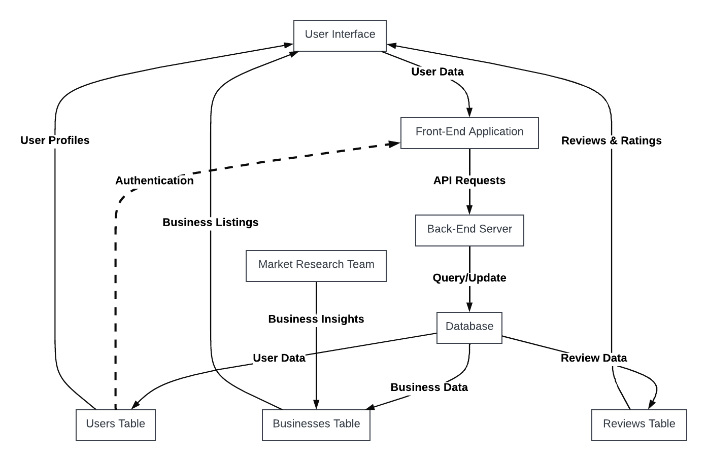
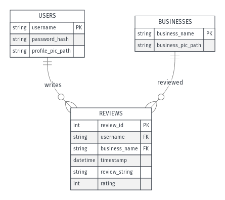

# Project Documentation: Local Business Review Platform

## Introduction
This document provides comprehensive documentation for the Local Business Review Platform, a web application designed to connect users with local businesses and allow them to post and read reviews.

## System Overview
The platform is structured into a frontend and a backend. The frontend is built for user interactions, while the backend handles data management, API services, and security.

### Technologies Used
- Flask (Python web framework)
- SQLAlchemy (Database ORM)
- SQLite (Database)
- React.js (Frontend framework)
- Figma (Frontend UI Layouts)

## Getting Started
### Prerequisites
- Python 3.x
- Node.js

### Installation
1. Clone the repository: `git clone [repository URL]`
2. Install dependencies: `pip3 install -r requirements.txt`and `npm i`

### Running the Application
- Backend: `python3 run.py`
- Frontend: `npm run dev`

## API Reference
### Endpoints
- `/register` (POST): Register a new user.
- `/login` (POST): Authenticate a user.
- `/businesses` (GET): Fetch all businesses.

### Data Models
#### User
- `username`: String, Primary Key
- `password_hash`: String
- `email_id`: String

#### Business
- `business_id`: Integer, Primary Key
- `business_name`: String
- `business_category`: String
- `business_pic_path`: String

#### Reviews
- `review_id`: Integer, Primary Key
- `username`: String, Foreign Key
- `business_id`: String, Foreign Key
- `timestamp`: String
- `review_string`: String
- `rating`: Integer

## Testing
- Testing the models: `python3 -m unittest tests/test_models.py`
- Tesing the routes: `python3 -m unittest tests/test_routes.py`
